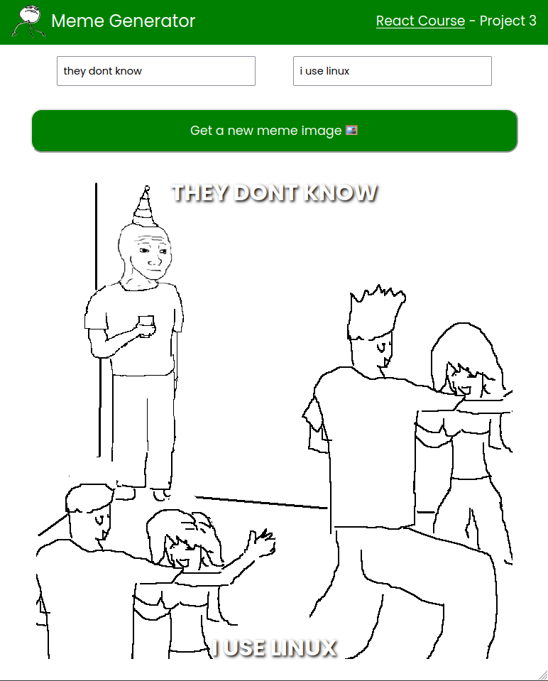

# Meme Generator

Generate funny memes with this simple interactive React app!

## Preview

## Running on your machine

To run this project locally, follow these steps:

1. Clone the repository
   (`git clone https://github.com/caiohenrique-3/meme-generator.git`)

2. Navigate to the project directory (`cd meme-generator`)

3. Install dependencies (`npm install`)

4. Start the development server (`npm run dev`)

The project will be accessible at http://127.0.0.1:8080.

## What I learned

Through this React course project, I delved into a variety of crucial concepts
and techniques. Firstly, I honed my proficiency in handling forms in React,
understanding how to efficiently manage user inputs and handle form submissions.

Additionally, I gained a deep understanding of the `useEffect()` hook, which
allowed me to perform side effects in my components. I specifically learned how
to properly clean up event listeners within the `useEffect()` hook, preventing
memory leaks in my application.

One of the highlights of this project was learning how to fetch data from APIs
in React, leveraging the power of `useEffect()` to efficiently make asynchronous
requests.

Lastly, I tackled more complex state management scenarios involving arrays and
objects using `useState()`. Overall, this course project provided me with a
comprehensive toolkit for developing robust and feature-rich React applications,
and I feel confident in my ability to tackle a wide range of projects in the
future.

## Acknowledgments

Special thanks to the following resources for their contributions to this
project:

- [React Course](https://www.youtube.com/watch?v=bMknfKXIFA8)
- [Google Webfonts Helper](https://gwfh.mranftl.com/fonts)
- [ImgFlip Meme API](https://imgflip.com/api)

## License

This project is licensed under the [MIT License](LICENSE).

---
